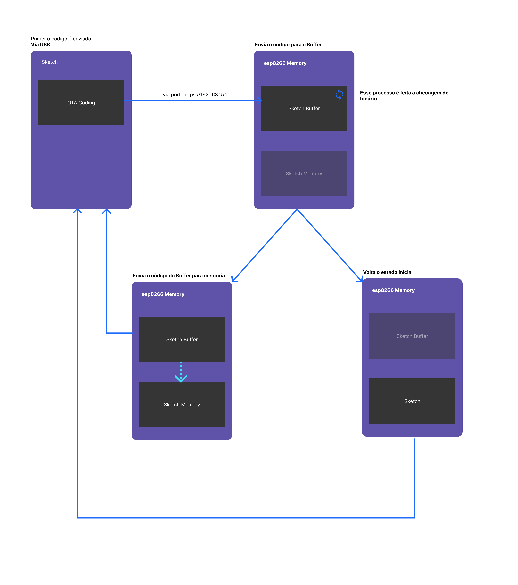

# Configurando seu primeiro OTA

### O que é OTA

OTA é um abreviação das palavras americanas `Over the Air` ou em tradução livre `pelo ar` que significa fazer atualizações de um novo firmware pela rede wifi(protocolo IP) ao invés de usar um cabo USB.



- [x] O que soluciona
- [x] Problemas
- [x] O que é o NodeMCU
- [x] Configurando

### Como Configurar a IDE

- [x] Configuração da IDE:

```url
    https://arduino.esp8266.com/stable/package_esp8266com_index.json,
    https://raw.githubusercontent.com/SpacehuhnTech/arduino/main/package_spacehuhn_index.json
```

- [x] Configurar para que o OTA seja sempre enviado
- [x] ArduinoOTA